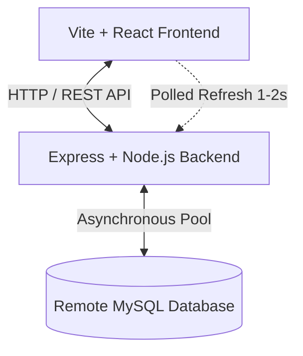
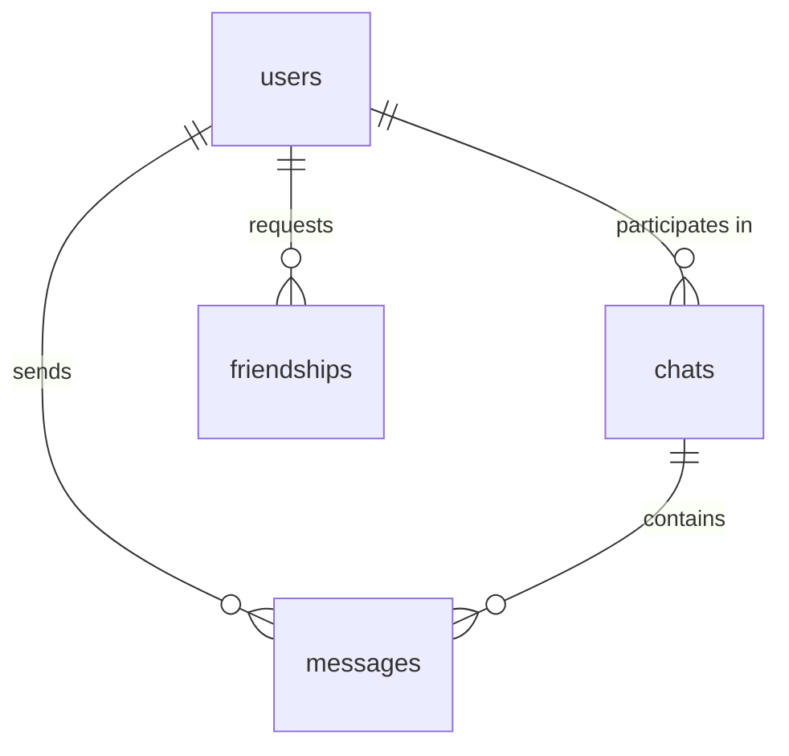

# ChatApp - Complete Technical Documentation

Welcome to the **ChatApp** developer documentation. This guide details the overall architecture, technologies used, database design, and key high-performance features that power this modern, real-time chat workspace.

---

## 1. Project Overview & Architecture

ChatApp is structured as a decoupled, full-stack application built for real-time messaging, immediate UI feedback, and highly optimized network loads:



* **Frontend**: Responsive React application bundled with **Vite**, styled using **Bootstrap CSS** for styling, and routing managed by **React Router**.
* **Backend**: Lightweight, scalable REST API built with **Node.js** and **Express**, utilizing connection pooling via the **mysql2/promise** driver.
* **Database**: Relational **MySQL** schema containing tables for users, chats, messages, and friendships.

---

## 2. Key High-Performance Features

### A. Optimistic UI Rendering (Instant Message Sending)
To ensure the interface feels snappy and responsive, the frontend utilizes an **Optimistic UI Update** strategy. 

When a user types a message and clicks **Send**:
1. **Instant Render**: Before sending the message via HTTP, the client instantly generates a temporary "optimistic" message object:
   ```javascript
   const optimisticMessage = {
     id: 'optimistic-' + Date.now(),
     content: content,
     sender_id: currentUserId,
     created_at: new Date().toISOString(),
     sender_name: currentUser?.full_name || 'Me',
     is_read: false
   };
   ```
2. **Immediate Append**: This object is appended to the message array state (`setMessages`) immediately, triggering an instant scroll-to-bottom animation. The user sees their message in the bubble **within 10-20 milliseconds**, bypassing network latency.
3. **Background Persistence**: Axiomatically, an asynchronous `POST` request is sent to the backend.
4. **Synchronization / Rollback**:
   * **Success**: Once the backend returns the official inserted database record, the frontend updates the official message state.
   * **Failure**: If the API request fails, the application rolls back the optimistic message, alerts the user, and restores the previous chat state to maintain data integrity.

---

### B. Consolidated Session Loading (Single-Roundtrip Chat Open)
Previously, opening a chat room forced the client to execute **three separate network requests sequentially** (fetch recipient profile $\rightarrow$ find/create chat session $\rightarrow$ fetch messages). On high-latency networks, this waterfall pattern led to a sluggish user experience with long loading spinners.

This was optimized into a **single consolidated API call** (`GET /api/chats/session/:otherUserId`):
1. **Backend Concurrency**: Inside the Express router, `Promise.all` executes SQL queries for user lookup, friendship verification, and chat lookup/creation **concurrently** on Node's async event loop:
   ```javascript
   const [friendship, chat, recipient] = await Promise.all([
       Friendship.getFriendshipStatus(currentUserId, otherId),
       Chat.findOrCreate(currentUserId, otherId),
       User.findById(otherId)
   ]);
   ```
2. **Unified Response**: Once verified, the server gathers the data, retrieves message history, marks messages as read, and bundles everything into one payload:
   ```json
   {
     "chat": { "id": 12, "user1_id": 1, "user2_id": 2 },
     "recipient": { "id": 2, "full_name": "John Doe", "status": "online" },
     "messages": [...]
   }
   ```
3. **Result**: Eliminating two client round-trips reduced initial chat loading times from **~1200ms to ~300ms**.

---

### C. Timezone/Timestamp Synchronization
To prevent timestamps in chat bubbles from shifting after a page reload, the database driver uses absolute UTC clock mapping.
* **Problem**: The remote MySQL server returns datetime stamps as raw strings. The driver would default to local time conversions, introducing a **5.5-hour timezone offset discrepancy** for users in different time zones.
* **Solution**: Configured `timezone: 'Z'` in the connection pool options inside [database.js](file:///c:/Users/dhani/Downloads/Telegram%20Desktop/Chat%20App/chat-app-backend/config/database.js). This forces `mysql2` to parse and serialize timestamps correctly as UTC ISO strings (`toISOString()`), which the browser converts perfectly to the local timezone.

---

### D. Dual-Pane Split-Screen & Sidebar Polling
The application layout mimics Telegram Web or WhatsApp Web:
* **Left Sidebar (Recent Chats)**: Displays active chats and remains visible at all times. It executes a **2-second background polling cycle** to look for new messages, unread count badge increments, or user online status changes.
* **JSON State Diffing**: To prevent screen elements from flashing or redundant re-renders during polling, the sidebar uses structural string comparison:
  ```javascript
  setRecentChats(prevChats => {
    if (JSON.stringify(prevChats) !== JSON.stringify(response.data)) {
      return response.data; // Only updates if data actually changed
    }
    return prevChats;
  });
  ```
* **Right Panel (Conversation Canvas)**: Adapts fluidly. Displays a beautiful welcome card by default, and overlays the active conversation card when a sidebar item is selected.

---

## 3. Database Schema

The database relies on four highly relational tables with cascading foreign keys:



1. **`users`**:
   * `id` (INT, Primary Key)
   * `full_name` (VARCHAR)
   * `email` (VARCHAR, Unique)
   * `password` (VARCHAR, Bcrypt hashed)
   * `status` (ENUM: `'online'`, `'offline'`, `'away'`)
   * `created_at` / `updated_at` (TIMESTAMP)

2. **`chats`**:
   * `id` (INT, Primary Key)
   * `user1_id` / `user2_id` (INT, references `users.id` with `ON DELETE CASCADE`)
   * Unique constraint on `(user1_id, user2_id)` to enforce exactly one chat instance per user pair.

3. **`messages`**:
   * `id` (INT, Primary Key)
   * `chat_id` (INT, references `chats.id` with `ON DELETE CASCADE`)
   * `sender_id` (INT, references `users.id` with `ON DELETE CASCADE`)
   * `content` (TEXT)
   * `is_read` (BOOLEAN, defaults to `FALSE`)
   * `created_at` (TIMESTAMP)

4. **`friendships`**:
   * `id` (INT, Primary Key)
   * `user1_id` / `user2_id` (INT, references `users.id`)
   * `status` (ENUM: `'pending'`, `'accepted'`)
   * `sender_id` (INT, tracking who initiated the request)
   * Unique constraint on `(user1_id, user2_id)` to prevent multiple relations.

---

## 4. Frontend Component Breakdown

The React components are designed to be focused and reusable:

* **[Home.jsx](file:///c:/Users/dhani/Downloads/Telegram%20Desktop/Chat%20App/Chat%20App%20UI/src/pages/Home.jsx)**: Main split-pane workspace dashboard. Manages active selected chats and modal states.
* **[ChatWindow.jsx](file:///c:/Users/dhani/Downloads/Telegram%20Desktop/Chat%20App/Chat%20App%20UI/src/pages/ChatWindow.jsx)**: Handles message input, optimistic updates, and consolidated network fetches. Flexes automatically between standalone page and embedded sidebar pane view.
* **[RecentChatList.jsx](file:///c:/Users/dhani/Downloads/Telegram%20Desktop/Chat%20App/Chat%20App%20UI/src/components/RecentChatList.jsx)**: Renders the active conversations list on the left side with background polling.
* **[UserList.jsx](file:///c:/Users/dhani/Downloads/Telegram%20Desktop/Chat%20App/Chat%20App%20UI/src/components/UserList.jsx)**: Handles new friend lookups, pending request tracking, and request accept/cancel operations.
* **[Header.jsx](file:///c:/Users/dhani/Downloads/Telegram%20Desktop/Chat%20App/Chat%20App%20UI/src/components/Header.jsx)**: Houses the global navigation, profile dropdown, logout mechanism, and a real-time polled notification bell for incoming friend requests.

---

## 5. Security Protocols

* **Password Hashing**: User passwords are encrypted with **Bcrypt** utilizing a work factor of 10 rounds before being saved to the database.
* **JWT-Based Authentication**: REST API routes are protected by a middleware (`authenticateToken`). Upon successful login, the server issues a JSON Web Token containing the user payload. The client attaches this token in the `Authorization: Bearer <token>` header of every Axios request.
* **CORS Access Safeguards**: Configured CORS middleware on the server to securely allow cross-origin requests from the React application host.

---

## 6. Deployment Readiness & Instructions

The application has been prepared and optimized for production deployment under two main configurations:

### Option A: Unified Full-Stack Hosting (Highly Recommended)
You can deploy the application as a **single consolidated service** (on platforms like Render, AWS, Heroku, or a VPS) where the Express backend serves the React frontend:

1. **Build Frontend**: Compile the React frontend assets into a highly compressed static bundle:
   ```bash
   cd "Chat App UI"
   npm run build
   ```
   This generates a `dist` production folder.
2. **Environment Variables**: Set the environment variables on your cloud hosting dashboard:
   * `NODE_ENV=production` (Tells Express to serve the static frontend bundle).
   * `DB_HOST`, `DB_USER`, `DB_PASSWORD`, `DB_NAME` (Remote MySQL credentials).
   * `JWT_SECRET` (Secure string for signing authentication tokens).
3. **Start Server**: Deploy and run `npm start` in the `chat-app-backend` directory. The Express server on port `5000` will handle API routes *and* serve the React UI seamlessly!

### Option B: Separated Hosting (Netlify/Vercel + Cloud API)
You can host the React frontend on a dedicated static host (e.g. Netlify, Vercel) and the Express backend separately:

1. **Frontend Base API URL**: The frontend is configured to read the API server URL from your environment variables:
   ```javascript
   baseURL: import.meta.env.VITE_API_URL || 'http://localhost:5000/api'
   ```
2. **Deploy Frontend**: Set `VITE_API_URL=https://your-deployed-backend.com/api` in your Netlify/Vercel project environment variables, and trigger `npm run build`.
3. **Deploy Backend**: Deploy the `chat-app-backend` node project on Render or Heroku, specifying the database environmental variables.

